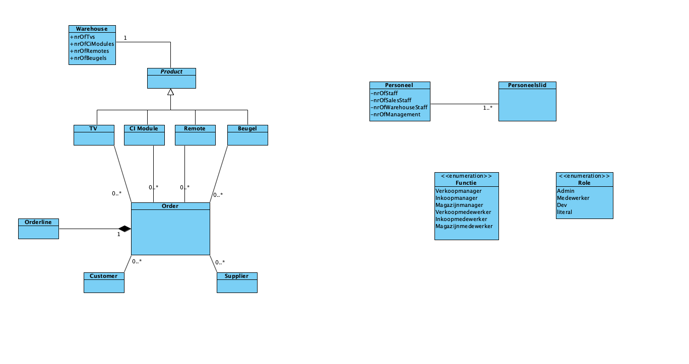

## Algemene eisen voor Management:
Drie kinderen gaan de zaak overnemen 
Hella:
- Inkoop:
  - Prijzen inkoop/verkoop
  - Aantallen per product
- Administratie
  - Personeel gegevens opvragen/aanpassen

Paulus:
- Verkoop
  - Hoeveel producten per soort op voorraad
  - Hoeveel producten komen er nog binnen

Robin:
- Magazijn
  - Locatie van product(en)
  - Op welk moment staat het product daar

Marketingcampagne:
- "Televisie voor jou!" naar "TechItEasy"

Producten omgeving:
- Aanwezige producten:
  - tv's
  - afstandsbedieningen
  - muurbeugels
  - ci-modules
- Opties:
  - Compatibiliteit >> Welke beugel hoort bij welke tv

Rechten in Producten omgeving:
- Hella, Paulus, Robin
  - Mogen lezen en aanpassen
- Werknemers
  - Mogen alleen lezen

  
# 15 requirements (minimaal)

### Functioneel Inkoop/Personeel
- Een inkoopmanager voegt bestellingen toe door door het inkoopformulier in te vullen
- Een inkoopmanager kan bestellingen goedkeuren die door inkoopmedewerkers zijn gedaan
- Een inkoopmanager kan in de voorraad kijken hoeveel producten er op voorraad zijn
- Een personeelsmanager kan in het personeelsbestand een overzicht laten tonen met hoeveel werknemers er in dienst zijn
- Een personeelsmanager kan personeelsgegevens inzien van een medewerker in het personeelsbestand
- Als personeelsmanager kan ik aanpassingen maken in de personeelsgegevens
- Aan het eind van de dag stuurt het systeem alle goed te keuren bestellingen naar de inkoopmanager
- Als inkoopmedewerker kan ik een inkooporder aanmaken via het bestelformulier
- Als inkoopmedewerker kan ik de inkooporders naar de inkoopmanager sturen ter goedkeuring

### Functioneel Verkoop
- Als verkoopmanager kan ik zien hoeveel producten (per soort) op voorraad zijn
- Als verkoopmanager kan ik zien hoeveel producten er binnenkomen naar aanleiding van inkoopbestellingen
- Als verkoopmanager kan ik een verkooporder plaatsen door het verkoopformulier in te vullen
- Als verkoopmanager kan ik een klant aanmaken in het klantenbestand
- Als verkoopmanager kan ik de prijs bepalen van producten in verkooporders
- Als verkoopmedewerker kan ik een verkooporder aanmaken via het bestelformulier
- Als verkoopmedewerker kan ik de verkooporders naar de verkoopmanager sturen ter goedkeuring

### Functioneel Magazijn
- Als magazijnmanager kan ik de totale voorraad opvragen van alle producten in het magazijn
- Als magazijnmanager kan ik een overzicht krijgen van het aantal ingekochte producten dat nog naar het magazijn onderweg is
- Als magazijnmanager kan ik een overzicht krijgen van welke producten er per welke datum uit het magazijn gaan (voor verkoop e.d.)
- Als magazijnmanager kan ik een werkschema maken voor de magazijnmedewerkers
- Als magazijnmanager kan ik een orderpick lijst maken voor een enkele magazijnmedewerker
- Als magazijnmedewerker kan ik een orderpick lijst uitdraaien

### Niet-functioneel
- De applicatie bevat een help button met instructies (over bijvoorbeeld hoe het bestelformulier in te vullen).
- De applicatie maakt twee keer per dag een backup van het systeem
- De applicatie maakt gebruik van OAuth voor veilig inloggen
- De applicatie heeft een light en dark mode
- De applicatie kan het lettertype vergroten voor de leesbaarheid
- De applicatie heeft bij ingewikkelde invulvelden een 'i' icoon staan met extra uitleg als je erover heen hovert
- De applicatie heeft genoeg capaciteit om zonder prestatieverlies te werken als het hele bedrijf werkt.

### Screenshot klassediagram

